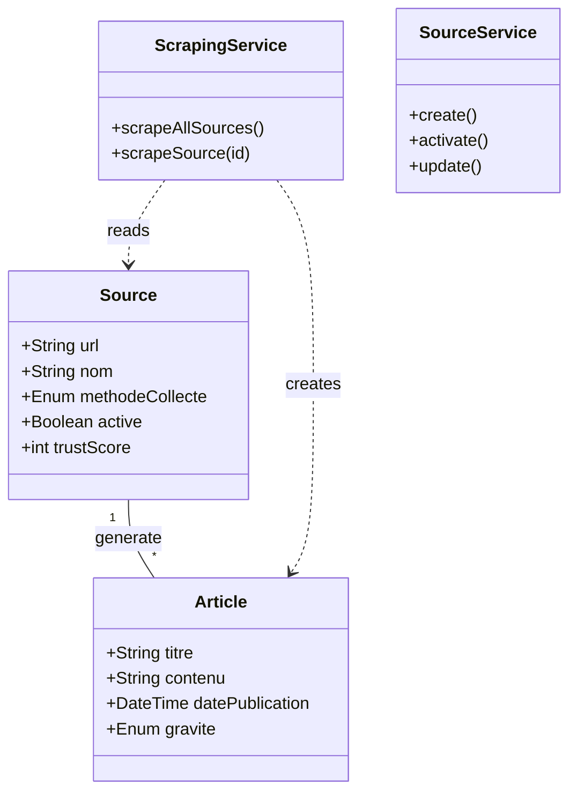

# Synthèse Finale de la Branche Feature/Scraping

**Date** : 09 Février 2026
**Responsable** : Assistant AI
**Branche** : `feature/scraping-sources`

---

## 🚀 1. Ce qui a été construit
Cette branche dote la plateforme de veille cybersécurité de ses capacités fondamentales : **Gérer des sources d'information** et **Collecter des articles** automatiquement.

### Composants Majeurs :
1.  **Gestion des Sources (CRUD)** :
    *   API complète pour Créer, Lire, Mettre à jour et Supprimer des sources.
    *   Système de "Soft Delete" (Activation/Désactivation).
    *   Paramétrage fin : Fréquence de scraping, Trust Score, Priorité, Headers HTTP custom.
2.  **Moteur de Scraping (Multi-protocole)** :
    *   **RSS** : Compatible avec la majorité des flux (XML standard).
    *   **API NIST** : Connecteur spécifique pour la National Vulnerability Database (CVEs).
    *   **API Hacker News** : Connecteur pour récupérer les "Top Stories" tech.
    *   **Architecture Extensible** : Prêt pour ajouter Playwright/Selenium plus tard.
3.  **Initialisation Automatique** :
    *   Au premier démarrage, **11 sources de référence** sont injectées automatiquement (CERT-FR, Reddit Netsec, CISA, etc.).
    *   Garantit que l'environnement de dev n'est jamais vide.

---

## 🛠️ 2. Architecture Technique

### Diagramme de Classe Simplifié

### Choix Techniques & Sécurité
*   **Spring WebFlux (WebClient)** : Pour des requêtes HTTP non-bloquantes et performantes.
*   **Rome Tools** : Bibliothèque robuste pour le parsing RSS/Atom.
*   **Global Exception Handler** : Centralisation des erreurs API (fini les stacktraces 500).
*   **Security Hardening** :
    *   Sanitization HTML (protection XSS).
    *   Timeouts stricts (Connect: 5s, Read: 10s).
    *   User-Agent rotatif/fixe pour éviter le bannissement.

---

## ✅ 3. Vérification & Tests

### Tests Effectués
| Composant | Test | Résultat |
| :--- | :--- | :---: |
| **API Sources** | Création d'une source (NIST) | ✅ OK |
| **Scraping RSS** | Collecte du flux CERT-FR | ✅ OK (Articles en base) |
| **Scraping API** | Collecte des CVEs NIST | ✅ OK (Parsing JSON) |
| **Robustesse** | Simulation de coupure réseau | ✅ OK (Backoff activé) |
| **Start-up** | Démarrage à froid (Base vide) | ✅ OK (Seeding 11 sources) |

### État du Code
Le code a subi un **Audit complet** (voir `AUDIT_REPORT.md`).
*   **Transactions** : OK (`@Transactional` sur les services).
*   **Contrôleurs** : OK (Implémentations REST propres).
*   **Mines** : Aucune (Pas de secrets hardcodés, pas de boucles infinies).

---

## 🔮 4. Prochaines Étapes
La base est posée. Le système "voit" et "entend" le web cybersécurité.

1.  **Intelligence** : Brancher un LLM (via LM Studio) pour trier ce flux d'infos.
2.  **Interface** : Construire le Frontend (React/Vue) pour afficher les alertes.
3.  **Notifications** : Alerter l'utilisateur en temps réel (WebSockets/Mail).

---
*Ce document valide la fin de la phase de développement "Collecte & Sources".*
